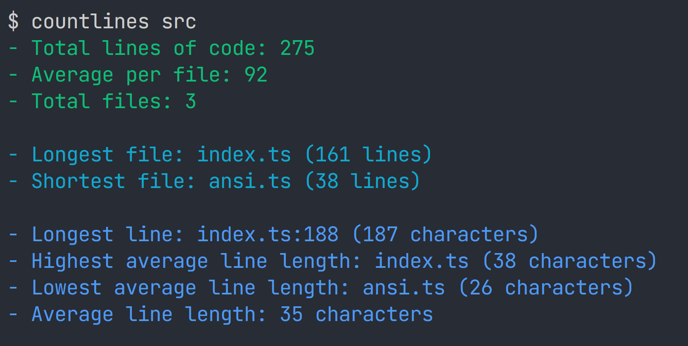

# CountLines
> Command-line interface to count the number of lines in a project.



## Usage
```
countlines [path] [options]
```

 - Note: `[path]` **must** appear before `[options]`

## Options

 -  `-a`, `--all-lines`    Count all lines, even if they have only whitespace
 -  `-f`, `--full-paths`   Print full paths to files
 -  `-e`, `--extensions`   List of file extensions to to include
 -  `-i`, `--ignored`      RegExp which matches lines that should be ignored